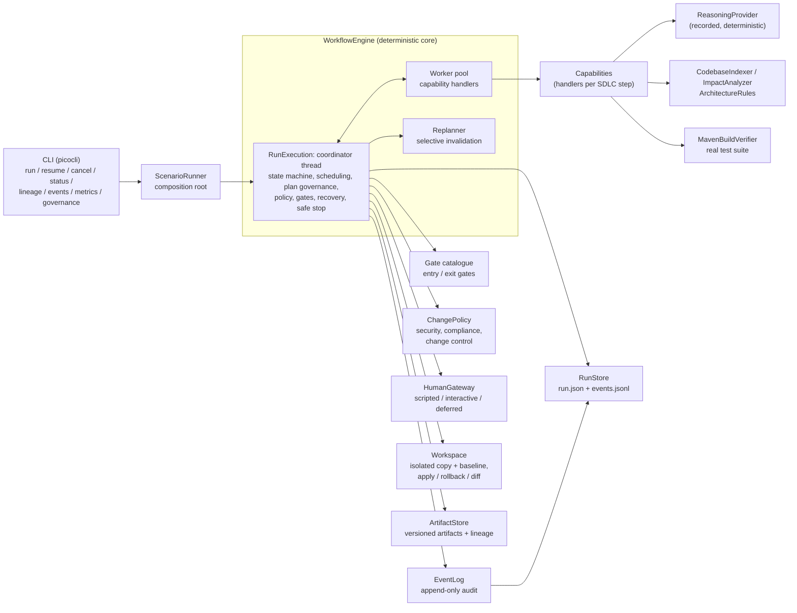
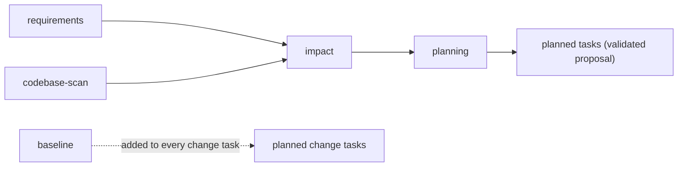
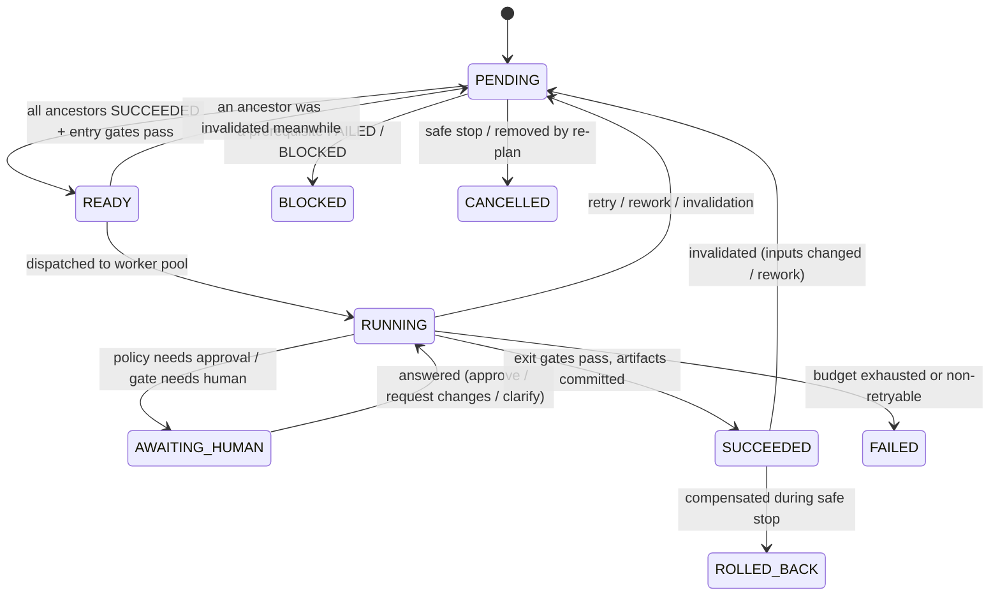
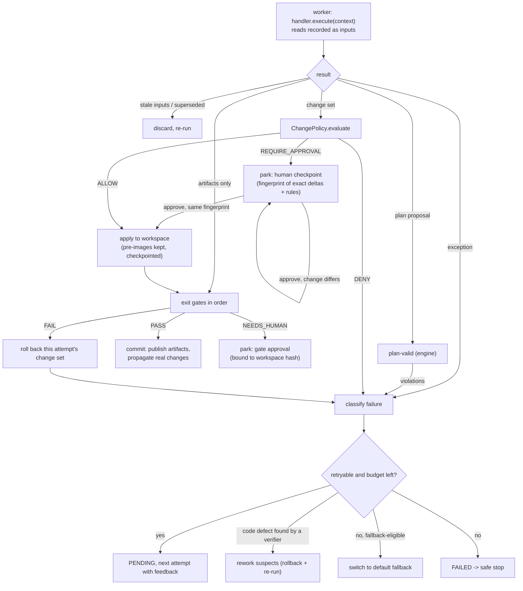

# Architecture

This repository contains two things that are deliberately kept apart:

- **`shortener/`** – a production-style URL shortening service (Spring Boot 4.1, Java 21, JDBC + Flyway on H2,
  REST API, click analytics, reliability features). It is the *target codebase*.
- **`orchestrator/`** – a governed, agentic SDLC orchestrator (plain Java 21 CLI). It takes a requirement through
  requirements analysis, codebase analysis, planning, design, implementation, testing, documentation,
  validation and release readiness, and produces a *reviewable outcome*: a patch against `shortener/`, the
  evidence behind it, and an engineering summary.

The guiding principle is **probabilistic reasoning at the edges, deterministic orchestration at the centre**.
Reasoning components only *propose* structured content (a requirement interpretation, a plan, a design, a
change set). Deterministic code owns every decision about what runs, when, whether a result is accepted,
whether a human must be asked, and what happens on failure.

## Components

| Package (`com.example.sdlc…`) | Responsibility |
|---|---|
| `engine` | `WorkflowEngine` (configuration: capabilities, gates, policy, reviewer, limits), `RunExecution` (one run: coordinator loop, dispatch, attempt lifecycle, plan governance, recovery, human checkpoints, safe stop), `Replanner` (selective invalidation, plan adoption), `PlanValidator`, run/task state, `EventLog`, gate and handler contracts |
| `plan` | `TaskSpec`, `WorkflowPlan` (a DAG by construction: construction rejects duplicates, dangling dependencies and cycles), `PlanProposal` |
| `artifact` | Versioned `ArtifactStore` with statuses CURRENT / SUPERSEDED / RETRACTED / REJECTED and recorded inputs |
| `capability` | The capability catalogue (with the *role* each capability plays in governance) and its handlers: requirement analysis, codebase scan, impact analysis, planning, design, change proposals (implement / author-tests / document), build and static verification, security review, API review, release assessment |
| `gates` | `StandardGates`: every entry and exit gate as a small pure function |
| `policy` | `ChangePolicy`: deterministic rules for proposed workspace changes; `PersonalData` classifier |
| `human` | Human checkpoint model (`HumanRequest`, `HumanResponse`) and the `HumanGateway` boundary |
| `reasoning` | Structured reasoning contracts and the deterministic `RecordedReasoningProvider` |
| `workspace` | Isolated workspace: canonical-path validation and containment, change preview, optimistic concurrency, apply with pre-images, integrity-checked rollback, unified diff |
| `codebase` | Static model of the target module (types, dependencies, layers, endpoints, tables, table access, request paths used by tests), impact analysis, layering rules |
| `verify` | Runs the target's real Maven test suite in the workspace (allow-listed environment) and classifies the result from Surefire reports |
| `metrics`, `report`, `store` | Metrics derived from events, lineage queries, engineering summary, persistence |
| `scenario`, `cli` | Scenario definitions, scripted/interactive reviewers, composition root, command line |

The orchestrator is a separate module (not a package inside the service) on purpose: a component that
writes files and runs builds must not ship inside an internet-facing service. The shortener module is
standalone-buildable, which is what allows the orchestrator to copy it into an isolated workspace and run its
real test suite there.

## Orchestration model

### Plans are data, behaviour is bound by name

A run starts with a fixed **bootstrap plan** (discovery) and then adopts the plan proposed by the planner:

`requirements`, `codebase-scan` and `baseline` (a real build of the untouched target) are independent and
run in parallel. The planner's proposal is a list of `TaskSpec`s that reference **capabilities by name**
(`design`, `implement`, `author-tests`, `document`, `verify-build`, `review-security`, `review-api`,
`assess-release`). Before the planner's result is accepted, the engine validates it (`plan-valid`) and enforces
what the planner cannot opt out of:

- only known, plannable capabilities; the graph must be a DAG;
- each change capability may only touch its own part of the workspace (`implement`: `src/main/`,
  `author-tests`: `src/test/`, `document`: `docs/`, `README.md`, the OpenAPI document) - a planner cannot give
  itself `**`;
- a plan that changes code must contain verification, a security review **and** an API compatibility review, and
  **every workspace-wide check** (verification, security review, API review, release assessment) runs after
  *all* change tasks, so none of them can read a workspace that another task is still changing;
- every verification task lists **every** change task in `verifies` (it builds and tests the whole tree, so any
  change - documentation included - can be the culprit it sends back for rework), and verification tasks never run
  in parallel with one another (they share the build directory); exactly one release assessment closes the plan
  and depends on every task;
- change tasks always wait for the baseline; retry budgets are clamped (3); mandatory gates are attached and
  the only fallback a task can have is its capability's default.

Governance is expressed through capability **roles** (`VERIFICATION`, `SECURITY_REVIEW`,
`COMPATIBILITY_REVIEW`, `RELEASE`), not capability names. A rejected proposal goes back to the planner as
structured feedback (the brownfield scenario shows this). Re-running the planner with an unchanged proposal
keeps the current plan version.

### Task lifecycle

A task is eligible only when **all of its ancestors** (not just direct dependencies) have succeeded, and this is
re-checked at dispatch; this is what keeps descendants from running while an upstream task is being redone.

### Attempt lifecycle

### Concurrency

One **coordinator thread** owns every state transition, gate evaluation, policy decision, workspace write and
event append. Handlers run on a fixed worker pool; they get an immutable view of the run's artifacts and read
the workspace live. Live reads are safe because only the coordinator writes, and plan validation orders every
workspace-wide check after all changes; an attempt whose recorded inputs changed while it was running is
discarded and re-run. This keeps the state machine free of locks and makes the event log a faithful total order
of what happened, while independent work still runs in parallel (for example the baseline build alongside
requirement analysis and design, the greenfield scenario's three implementation branches, and the final
verification alongside the security and API reviews). Parallelism is observable (`inFlight` on every
`TASK_STARTED` event, worker thread names on completion) and proved by a test in which two branches must meet
at a `CyclicBarrier`.

**Fault barrier.** Any unexpected exception on the coordinator (a gate bug, an I/O error, a rollback that finds
a file changed underneath it) is turned into a safe stop instead of escaping and leaving the run stuck in
`RUNNING`.

### Human checkpoints

A checkpoint parks the task (`AWAITING_HUMAN`) with everything needed to continue it later, records a
`HumanRequest`, and asks the `HumanGateway`. A scripted reviewer (scenario file) or the interactive terminal
reviewer may answer immediately; otherwise the run keeps doing any other ready work and then **pauses safely**
(status `AWAITING_HUMAN`), persisting its state. `sdlc resume` records the decision (`--approve`, `--reject`,
`--request-changes <id> [--target <task>]`, `--answers <file>`) and a new process continues exactly where the
run stopped, keeping the reviewer mode the run was started with. `sdlc cancel` is the human-initiated safe stop.

Approvals are **bound to what was shown**:

- a change-set approval carries a fingerprint of the exact deltas and policy rules the reviewer saw; the change
  is previewed and evaluated again on approval, and anything different - a changed file, a new finding - asks
  again instead of applying;
- a gate approval (design or release sign-off) is bound to the workspace state; if the workspace changed while
  waiting, the approval does not complete the task and the evidence is re-assessed;
- a scripted rule for a change approval lists the policy rules it covers and matches only if it covers *every*
  rule in the request (approving a migration never silently approves an unanticipated edit bundled with it);
- a change request may only target the checkpoint's task or one of its prerequisites.

Approvals are published as `approval/<id>` artifacts produced by `human:<name>`, so later reviews and lineage
queries can prove who allowed what.

**What a reviewer sees.** A change-set checkpoint names the files, the policy findings and a bounded excerpt of
the removed (`-`) and added (`+`) lines of the actual line diff. The complete previewed diff - byte-faithful,
including line-ending and final-newline changes - is persisted before the reviewer is asked: as the
engine artifact `change-review/<request-id>` (with the exact approval fingerprint) and as
`runs/<id>/approvals/<request-id>.patch`, which the request details point to. If the proposal changes, the
new checkpoint gets a new diff and a new fingerprint; the earlier approval never applies to it.

## Governance

### Change policy

`ChangePolicy` evaluates the *concrete* change: canonical paths, operations (derived from before/after
content, so a delete-then-create is an edit), added content, whether a file exists in the baseline, the task's
scope and the impact analysis. The proposer's self-declared risk is recorded (`GOV-01`) but never used to relax
a decision. The verdict is the most restrictive finding.

| Rule | Category | Decision | Meaning |
|---|---|---|---|
| SEC-01 | Security | DENY | Hard-coded secret or credential in added content (code, YAML, properties) |
| SEC-02 | Security | DENY | Process execution or dynamic code loading added to production code |
| SEC-03 | Security | DENY | Build toolchain or CI configuration modified (`mvnw`, `.mvn/`, `.github/`) |
| SEC-04 | Security | APPROVAL | Existing request-handling or validation code changed (`web/`, `api/`, controllers, validators, policies) |
| SEC-05 | Security | APPROVAL | Process execution added to test code, which verification runs on the host |
| SEC-06 | Security | APPROVAL | New request-handling code added (a new controller, or a new file in a `web/` or `api/` package) |
| CMP-01 | Compliance | DENY | Schema stores raw personal data (IP address, e-mail, phone, user agent) |
| CMP-02 | Compliance | DENY | Personal data written to application logs |
| CC-01 | Change control | DENY | Already-applied migration or existing SQL resource modified or deleted |
| CC-02 | Change control | APPROVAL | New (not yet applied) migration or SQL resource added or changed |
| CC-03 | Change control | DENY | Destructive schema or data operation in a migration or SQL resource |
| CC-04 | Change control | APPROVAL | Dependency / build descriptor change |
| CC-05 | Change control | DENY | File outside the task's approved scope |
| CC-06 | Change control | APPROVAL | Existing source changed that impact analysis did not anticipate |
| CC-07 | Change control | APPROVAL | Large change (> 15 files or > 800 changed lines) |
| CC-08 | Change control | APPROVAL | Existing test deleted or tests disabled |
| CC-09 | Change control | APPROVAL | Spring application configuration changed (`application*.yml`, `.yaml`, `.properties`, `.xml`) |
| CC-10 | Change control | DENY | Configuration that redirects schema management or loads other configuration, or cannot be parsed |
| GOV-01 | Governance | ALLOW | Self-declared risk recorded, not trusted |

Migration rules apply to every SQL file under `src/main/resources`, not only to `db/migration`, so moving a
script elsewhere does not escape CC-01/02/03 or CMP-01 (SQL under `src/test` is treated as a test fixture). Spring
configuration is a control plane: any change to an application config file needs approval (CC-09), and CC-10 is
decided structurally - both versions are parsed (all YAML documents, `.properties`, XML properties), keys are
normalised the way Spring's relaxed binding does, and changes under `spring.flyway.*`, `spring.sql.init.*`,
`spring.config.import/location`, profile activation, JPA DDL generation, connection-init SQL or a JDBC URL whose
`INIT=` script appears (also through `${...}` placeholders) are denied. The Java rules (SEC-02, SEC-05, CMP-02)
also run on whitespace-collapsed added statements, so a line break cannot split a pattern. Known limits, all on the
side of caution or documented: a comment or string that merely mentions a forbidden API is flagged too; YAML
aliases in application configuration are refused rather than resolved; personal data stored in numeric columns
(a phone number as `BIGINT`) is not recognised by CMP-01. Two CC-10 gaps get an approval request instead of a
denial: an H2 `INIT` script passed as a pool or driver property rather than in the JDBC URL (for example
`spring.datasource.hikari.data-source-properties.INIT`), and an `INIT=` script behind `${...}` placeholders that
expand beyond the resolver's bounds (ten rounds of substitution, 100,000 characters). Neither is applied
autonomously: both are application configuration changes, so CC-09 still requires human approval with the complete
proposed diff (`approvals/<request-id>.patch`) available to the reviewer.

The security review re-applies the policy to the **aggregate** diff and cross-checks that every
approval-requiring finding is backed by a recorded approval for the task that introduced it. Findings that
exist only in the aggregate (such as overall size) are put in front of the release reviewer.

These rules are pattern-based guardrails, not a proof: they are tested against realistic bypass attempts
(aliased paths, symbolic links, statements split across lines, SQL comments hiding statements), but a
determined adversary with a live model could find shapes they miss. Human approval and the aggregate review
are the second line of defence.

### Gates

| Gate | Where | What it enforces |
|---|---|---|
| `requirement-quality` | exit, requirements | Acceptance criteria exist; blocking questions, HIGH-impact assumptions no human has answered, and unquantified criteria stop for clarification - even if the reasoning output marked them settled |
| `impact-grounded` | exit, impact | Every component the reasoning named exists in the real codebase |
| `plan-valid` | engine, planning | Plan governance (above) |
| `design-quality` / `design-approval` | exit, design | Justified decisions, well-formed contract, no raw personal data (judged from column names too, not only the proposer's label); human sign-off for HIGH-impact decisions and data model changes |
| `workspace-integrity` | entry, change / verification / review tasks | Workspace equals baseline + governed change sets; no links or special files |
| `baseline-green` | exit of baseline, entry of change tasks | Never build on a red baseline (a degraded static baseline is allowed but blocks release later) |
| `architecture-conformance` | exit, implement | No new layering violations (re-indexes the changed workspace) |
| `criteria-traced` | exit, author-tests | Every acceptance criterion is referenced by a test |
| `tests-pass` / `acceptance-coverage` | exit, verify-build | Real suite passed; every criterion referenced by a passing test class; otherwise a code defect with suspects |
| `static-checks-pass` | exit, verify-static | Degraded fallback checks |
| `security-clean` / `api-compatible` | exit, reviews | No open findings; no breaking change to the documented API - compared recursively (nested properties, array items, `allOf`/`oneOf`/`anyOf`): removed operations, schemas or properties, changed property types, newly required request properties or parameters, removed or changed 2xx responses, documented handlers that disappeared; new operations implemented and documented |
| `readiness-checklist` / `release-approval` | exit, release | Evidence-based checklist (below), then human sign-off |

Release readiness is computed only from evidence: the baseline and the final verification were real builds that
passed; the verified tree is exactly the tree being released; every baseline test class still passes and no
tests were lost; every criterion is covered; security and API reviews are clean; documentation changed if the
API did. A degraded (static) verification can therefore never be released, whatever a human would approve.
API compatibility is judged only from the independent API review: without one, the item fails as soon as any
change touched an API-relevant path (`api/` or `web/` packages, controllers, the OpenAPI document); the design's
own "unchanged" labels are never accepted as evidence.

## Failure handling and recovery

| Failure kind | Retried | Fallback | Typical source |
|---|---|---|---|
| TRANSIENT | yes | yes | build timeout or infrastructure error, I/O errors |
| UNAVAILABLE | no | yes | build tool disabled or could not be started |
| INVALID_OUTPUT | yes | yes | reasoning output violates its contract; edit anchor not found; invalid path |
| POLICY_DENIED | yes (with violations as feedback) | no | change policy |
| GATE_FAILED | yes (with gate findings) | no | exit gates, plan validation |
| CONFLICT | yes | no | optimistic concurrency on apply; workspace changed while waiting for approval |
| CHANGES_REQUESTED | yes | no | reviewer requested changes |
| CODE_DEFECT | rework upstream | no | verification found a defect |
| REJECTED, REASONING_UNAVAILABLE, FATAL | no | no | reviewer rejection, no recording, unexpected error |

- **Bounded retries.** Attempts per generation are capped (spec value, clamped to 3); fallbacks have their own
  budget (2); re-planning waves per run are capped (8); every verification build has a hard timeout.
- **Fallback.** `verify-build` falls back to `verify-static` (degraded, clearly marked); the baseline build falls
  back to a static baseline. Fallbacks keep the run informative but readiness refuses degraded evidence.
- **Rework.** When verification finds a defect, the engine attributes it to the change set most likely
  responsible (files named by compiler errors; otherwise, for each failing test, a changed resource it loads by
  name - such as the OpenAPI document read by a contract test - together with symbols quoted in its failure message
  that a change set introduced, or else types it references) and sends only those tasks back, with the failing test
  output as feedback. Their change sets are rolled back first. Rework consumes the target's attempt budget. If the
  suspects lie outside the verifier's declared coverage, nothing is reworked: the verification fails with a
  message naming them and the run stops safely.
- **Rollback.** Every applied change set keeps the pre-image of each file and the hash of what was written, and is
  checkpointed before its exit gates run. Rollback refuses to proceed if a file no longer holds what was written,
  so it can never silently destroy other work; rollbacks run in reverse application order and every rollback
  event records its cause (`attempt-rejected`, `rework`, `invalidation`, `safe-stop`, `orphaned`).
- **Safe stop.** On an unrecoverable failure, rejection, exhausted budget or engine error the engine stops
  dispatching, lets running work drain (discarding its results), blocks dependents of failed work, cancels the
  rest and pending checkpoints, keeps the full diff as an `outcome/abandoned-changes` artifact, compensates every
  applied change set and verifies that the workspace hash equals the baseline hash. The run ends `HALTED` with
  verdict `NOT_READY`; if compensation is impossible the status says exactly which change sets need manual
  attention.
- **Interrupted processes.** Applying is write-ahead - the change set is recorded and saved before any file is
  written - and the run is saved again after every rollback. A process can still stop between a disk change and
  the next save, so on resume (and on `sdlc cancel`) the applied-change stack is first reconciled with the
  workspace: the engine finds the smallest set of change sets whose rollback (newest first, a whole change set at a
  time, at most one interrupted part-way - or a write that never completed) explains exactly what is on disk, drops
  them without touching disk and only completes the one interrupted restore. A file that matches no image of any
  change set touching it is never written and stops the run for manual attention. A task whose committed change
  was dropped this way runs again. Each recovery is a `CHANGESET_RECOVERED` event, not a second rollback. Attempts
  orphaned by the crash are then recovered: a change set they applied but never committed is rolled back, the
  attempt does not count, and the task runs again.

## State, artifacts and lineage

Everything a run knows lives in `WorkflowRun` (persisted as `runs/<id>/run.json`): plan history, task states
(generation, attempt, executions, history, recorded inputs and outputs, parked checkpoint), artifacts, human
requests and the stack of applied change sets.

Artifacts are immutable, versioned values with a content hash. The engine – not the handler – records which
artifact versions each attempt read: `TaskContext.read` records artifact inputs, and reading a workspace file
records the change set that last wrote it. A handler can only see artifacts produced by its graph ancestors,
by humans or by the engine. That gives every artifact answers to *what produced it* (task and attempt), *what
it was derived from* (including human decisions such as clarifications and approvals), *what depends on it*
and *whether it has been superseded* (`sdlc lineage <run> <artifact>`). When identical content is republished,
the version is kept and its provenance points at the latest derivation. Outputs of attempts that failed their
gates are kept as `REJECTED` versions: never visible to other tasks, but available as evidence (for example
the checklist behind a `NOT_READY` verdict).

## Dynamic re-planning

Re-planning happens when upstream information changes: a new plan version, a reviewer requesting changes
to an upstream task, a clarification answer, rework after a failed verification, or any artifact being
republished with different content. The `Replanner` computes the affected work from recorded lineage, not
from the graph:

- **Hard invalidation** for tasks that changed the workspace: their change sets are rolled back and their
  outputs retracted immediately, so everything that consumed them is invalidated too.
- **Soft invalidation with early cutoff** for pure tasks (design, analysis, reviews): they re-run while their
  previous outputs stay current. When they finish, only outputs whose content actually changed get a new
  version, and only consumers of those versions are invalidated. Identical outputs keep their version, so
  unrelated completed work stays valid and is not re-executed.

Tasks declare narrow inputs (for example `decision/D-2`), so a revised decision reaches only the work derived
from it. A plan revision is diffed against the previous version: unchanged tasks are preserved, changed tasks
are invalidated (judged by their previous definition, so a task that keeps its id but no longer changes files
still has its earlier change set rolled back), removed tasks are compensated and cancelled, new tasks are added. Checkpoints of invalidated
work are withdrawn (and logged as such), and results of attempts that were running while their inputs changed
are discarded when they arrive.

## Observability and reliability metrics

Every transition is an `ExecutionEvent` in an append-only log (`runs/<id>/events.jsonl`) with a sequence
number, timestamp, task, attempt, human-readable reason and machine-readable data (`sdlc events`). Metrics
are derived only from these events (`ReliabilityMetrics`, `sdlc metrics`):

| Metric | Definition |
|---|---|
| Task success rate | tasks whose last outcome was success / tasks that finished (successful executions are reported separately) |
| Retry rate | retries scheduled / attempts started |
| Rollback rate | change sets rolled back / change sets applied; *failure rollback rate* counts only rollbacks forced by failures (rejected attempts, safe stop, orphaned attempts), not planned rework or re-planning |
| MTTR | mean time from the first failed attempt of a task to its next success (retry, fallback or rework); includes human decision time when recovery passes a checkpoint |
| End-to-end latency | first to last event; *active time* excludes pauses and periods in which the run was only waiting for a human |
| Others | fallbacks, reworks (defects sent back by verification and upstream changes requested by reviewers), invalidations, plan revisions, policy denials, human checkpoints and decisions, rollbacks by cause, max concurrency |

`sdlc metrics` without a run id aggregates across all persisted runs (run success rate, READY runs, mean/max
latency, MTTR).

## Reasoning boundary

`ReasoningProvider` has one method per reasoning step, each taking a structured request (including the
task's feedback from failed attempts) and returning a structured contract (`RequirementSpec`,
`ImpactSeeds`, `PlanProposal`, `DesignProposal`, `ChangeProposal`). Handlers validate the structure; gates
judge the content. A provider cannot mark its own output as acceptable, choose how a failure is handled (it can
only report "unavailable" or "invalid output"), request an approval-free path, or affect scheduling.

The shipped provider is `RecordedReasoningProvider`: it replays recorded outputs from
`scenarios/<id>/recordings/<task>.<invocation>.yaml`, where *invocation* is the task's execution count
(persisted, so replay is stable across pause and resume). Every reasoning request carries the human
clarification answers, which are also recorded as an input of whatever it produces. Recordings can declare the
answers they were made for (`expect.answers`, checked for every request kind), and a scenario can record
alternative continuations keyed by answers: `recordings/variants/<name>/variant.yaml` lists the option answers
(`when`) it was recorded for; if the answers match exactly one variant, only that directory is used. Recordings
may only include content files from their own `files/` directory; when there is no matching recording the
provider fails with `REASONING_UNAVAILABLE` and the run stops safely instead of improvising. A
live model-backed provider would implement the same interface (prompting with the request and parsing a
JSON-schema-constrained response); nothing else would change.

**Execution of proposed code.** Verification runs the target's build - including code and tests written by
the reasoning side - on the host, with an allow-listed environment so that unrelated secrets are not passed
on. That limits leakage but is not a sandbox; with a live model the orchestrator should run inside a container
or VM with no network and only the workspace writable.

## Key decisions

| Decision | Why | Trade-off |
|---|---|---|
| Orchestrator as a separate plain-Java module | Agent runtime must not ship in the service; no container needed for a CLI; explicit wiring is easy to test | Two build units; Spring Boot's parent is used for dependency management only |
| Single coordinator thread + worker pool | Lock-free state machine, total event order, still real parallelism | Gates must stay cheap (expensive checks are tasks) |
| Plans as validated data bound to named capabilities with governance roles | Reasoning cannot invent actions, widen its own scope or remove mandatory gates | New capabilities require code |
| Changes proposed, applied only by the engine | Policy and approvals sit between proposal and effect; rollback is always possible | Handlers cannot run arbitrary commands |
| Exact search/replace edits on canonical paths with optimistic concurrency | Stale or aliased proposals fail loudly instead of merging silently | Proposals must quote exact anchors |
| Approvals bound to fingerprints / workspace state | A human's decision cannot be reused for something they did not see | A changed proposal needs a new decision |
| Real verification with the target's own Maven build | Evidence is the real test suite on the real code | Slower (seconds per build); requires a JDK and cached dependencies; runs proposed code on the host |
| Lineage-based invalidation with early cutoff | Only work affected by a real change is redone | Handlers must read inputs through the context (enforced by visibility) |
| Deterministic recorded reasoning | Reviewable and testable without an API key | Scenarios cover the recorded paths; other human answers stop safely |
| File-based persistence (JSON snapshot + JSONL log) | Inspectable, resumable, no infrastructure | Single writer per run; not a multi-tenant workflow service |
| Type-level static analysis (regex/token based) | Small, dependency-free, good enough for impact, test selection and layering on a Spring codebase | Over-approximates (e.g. a repository that reads and writes a table appears on both paths) |
